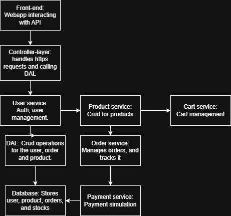

--Commerce System  
--A project to mimic real world purchases and transactions.  

 --Finished Features
    -- User Authentication(100%)- Secure login, registration, JWT-based authentication.
    -- Shopping Cart Functionality(100%)- Add or remove products, update quantities, cart persist state.
    -- Payment stimulation(100%)- Stimulated transactions, Order placement, and payment confirmation.
   
 --Additional Features(To be implemented)
      -- Product Management- Crud for products.
      -- Administrator panel(30%) - Dashboard for user, product and orders management.

--Architecture Diagram

     
